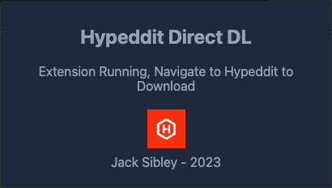

 

<h1 align="center"> Hypeddit Skip </h1>

Allow to Bypass Hypeddit download gates and download target file directly.

## Installation:

1. Download ZIP from this repo, extract its contents into a designated directory on your computer.

2. Proceed to access Google Chrome and navigate to the extensions management page by entering "chrome://extensions" into the address bar.

3. Activate "Developer Mode" by toggling the switch situated in the upper-right corner of the page.

4. Subsequently, click the "Load unpackaged extension" button and designate the folder containing the extracted ZIP file.

5. The Hypeddit direct download extension should now be visible within your roster of installed extensions.

6. Navigate to Hypeddit.com and select "Get This Track" for the desired download.

7. Opt for "Skip DL Gate" to initiate the download process.

## Contribution

Suggestions and pull requests are welcomed!
